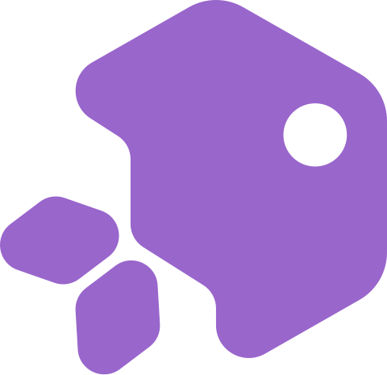
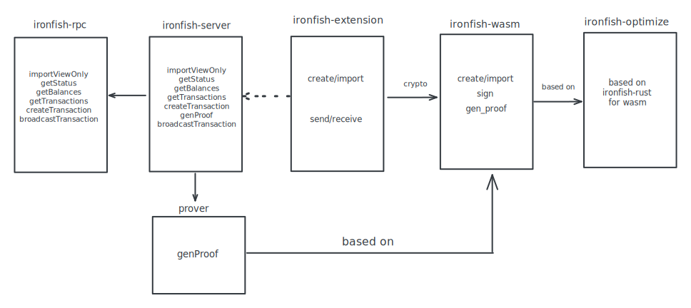

  

<h1 align="center">
  OreoWallet
</h1>

  A browser extension wallet for IronFish blockchain.

## Intro

There are 4 types wallet for privacy blockchain like IronFish on my side.

- Type1: Cex wallet, fully-custodial wallet.
- Type2: PrivateKey is safely saved locally while viewkey is uploaded to a backend server for better experience. Transactions are signed locally while transaction decryption and utxos-indexing rely on customsized remote server.
- Type3: Both transaction decryption and creation are performed locally while transaction fetching/broadcasting rely on a public remote rpc like metamask.
- Type4: A wallet embedded with a full node, syncs blocks/transactions with P2P network directly.

OreoWallet aims to build an easy-to-use Type2 extension wallet for Ironfish blockchain.

## Development Roadmap

### Milestone 1: Iron Fish wallet-only sdk in wasm (Done)
- To build an extension wallet, wasm sdk is needed.
- The sdk should support account creation and transaction creation to support type2 wallet.
- The sdk should support all wallet functionalities to support type3/type4 wallet.

### Milestone 2: Type2 wallet for better experience (Done)
- Account creation, import, export (compatible with current Iron Fish wallet).
- Support IRON native token transfer.
- Support user created asset transfer.
- Support native mint/burn transaction.
- Support Orescriptions NFT display and transfer.

### Milestone 3 (V1): Type3 wallet for better privacy (Deprecated)
- Transaction decryption locally.
- A fully no-custodial type3 wallet.

### Milestone 3 (V2): Optimizing data provider and improving user experience (Ongoing)
- Prover, transaction proof generation
- DecryptionWorker, transaction decryption
- Encryption mechanism, design a mechanism to encrypt messages between server and user 
- 3 articles about Ironfish and OreoWallet
- 3 activities with IFLabs to get more users
- 5k OreoWallet users
- 100k IRON in OreoWallet

### Milestone 4: Intergation with privacy protocol on routing layer (Done)
- Privay wallet on routing level and transaction level. 

### Milestone 5: More features enabled and ongoing maintenance updates
- Local merkle tree storage optimization if we can.
- Transaction decryption/creation optimization with webgpu if we can.
- Support bridges if we have in Ironfish.
- Continuous version iterative development.
- Ongoing maintenance updates with long term support.

## Features

| Feature                  | Status |
| ------------------------ | ------ |
| Account creation/import  | ✅      |
| IRON native token        | ✅      |
| User created asset       | ✅      |
| Orescriptions NFT        | ✅      |
| Dapp provider            | ✅      |
| Local data provider      | ✅      |
| Local prover             | ✅      |
| Privacy on routing layer | ✅      |
| Quick scan               | ✅      |
| ...                      | ...    |

## Documentation

There is a README in each package, as well as comments in the source code.

## Project structure

<pre>
oreowallet
├── <a href="https://github.com/oreoslabs/oreowallet-extension">oreowallet-extension</a>: OreoWallet frontend ui 
├── <a href="https://github.com/oreoslabs/ironfish-optimize">ironfish-optimize</a>: Optimized version of ironfish-rust for wasm env
├── <a href="https://github.com/oreoslabs/ironfish-wasm">ironfish-wasm</a>: Core wasm sdk of OreoWallet
├── <a href="https://github.com/oreoslabs/ironfish-server">server</a>: Backend for necessary api service and task scheduling
├── <a href="https://github.com/oreoslabs/ironfish-server">prover</a>: Prover to genereate proof for OreoWallet transactions
</pre>

## OreoWallet V1 arch

## OreoWallet provider api (In development)

Check out [provider.md](./provider.md) for details on how to integrate OreoWallet into your dapps.

## Issues

If you find a bug or have a feature request, please [open an issue](https://github.com/oreoslabs/oreowallet/issues/new).

## Contributing

Check out [CONTRIBUTING.md](./CONTRIBUTING.md) for details on how to contribute.

## Get help

Reach out to the community on [Twitter](https://twitter.com/oreowallet) to get help.

